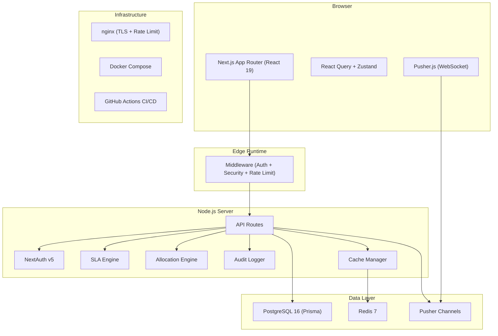

# PV-OpsHub Architecture

## System Overview

## Multi-Tenancy

- Row Level Security via Prisma middleware injection
- All queries scoped by `tenantId`
- Tenant-specific configuration (branding, SLA rules, allocation rules)

## Security

| Layer | Implementation |
|-------|----------------|
| Auth | NextAuth v5 + bcrypt + session tokens |
| RBAC | 7 roles × 30 permissions matrix |
| Encryption | AES-256-GCM (audit data at rest) |
| CSRF | httpOnly cookie + timing-safe comparison |
| Input | XSS/injection sanitization |
| Transport | TLS 1.2+ via nginx |
| Headers | CSP, HSTS, X-Frame-Options |

## Caching Strategy

| Data | TTL | Invalidation |
|------|-----|-------------|
| Dashboards | 30s | On case/allocation mutation |
| Case lists | 15s | On case create/update |
| SLA rules | 1hr | On admin config change |
| Leaderboards | 5min | Periodic refresh |

## Database Indexes

- 11 composite indexes (including partial and GIN FTS)
- All critical queries use index-only scans
- Full-text search on cases via PostgreSQL GIN
